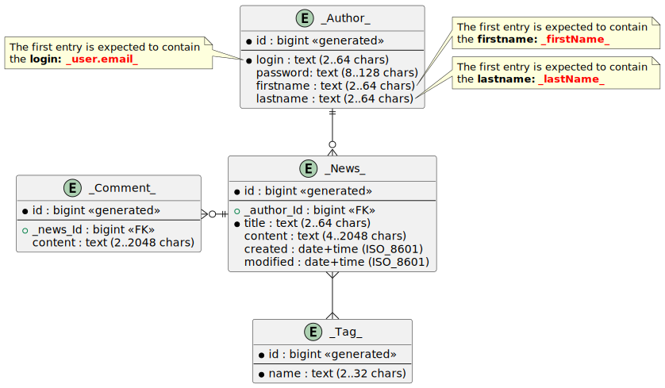

#  Task310. REST Architectural Style (Basics)

### Given: 
- The system under development handles entities **{{Author}}**, **{{News}}**, **{{Tag}}**, and **{{Comment}}**, which are logically related by 
  - one-to-many (**{{Author}}** and **{{News}}**, **{{News}}** and **{{Comment}}**) 
  - many-to-many (**{{News}}**, **{{Tag}}**). 
- It is necessary to develop a solution in the architectural style of REST, taking into account the development of the application.

> Api versions are expected to change in future jobs. With this change, there will be a new prefix and (possibly) 
> port. This work was chosen as the starting point for automated verification of this and subsequent works. 
> Test carefully designed functionality. 
> 
> We will most likely go through the REST topic again, in more depth, with additional 
> search, pagination, partial modification capabilities 
> and support [HATEOAS](https://ru.wikipedia.org/wiki/HATEOAS).

### Task

- The basis for the task is the following application scheme:

- Data model:
  - You must create the entities specified in the diagram 
    - **{{Author}}**
    - **{{News}}**
    - **{{Tag}}**
    - **{{Comment}}**
    - You can use a common abstraction for entities if necessary
- You need to create a DTO:
  - for input parameters (requests)
    - **{{Author}}RequestTo**
    - **{{News}}RequestTo**
    - **{{Tag}}RequestTo**
    - **{{Comment}}RequestTo**
  - the output result(s)
    - **{{Author}}ResponseTo**  
    - **{{News}}ResponseTo** 
    - **{{Tag}}ResponseTo** 
    - **{{Comment}}ResponseTo**
  - It is important that DTOs have such names for internal backend needs, and that the view layer (in json) has the expected entity names, namely: **{author}}**, **{{news}}**, **{{tag}}**, and **{{comment}}**.
- Storage layer:
  - Create a generic interface for storing and retrieving entity data for CRUD operations.
  - Create an InMemory implementation of the developed interface (for example, as a Map collection) for the **{Author}}**, **{{News}}**, **{{Tag}}**, and **{{Comment}}** entities.
- Service layer: 
  - Create services for **{Author}}**, **{{News}}**, **{{Tag}}**, and **{{Comment}}**.
  - Implement business logic (CRUD) in services to process object data
  - Implement services to transform DTO objects to entities (for queries) and vice versa (for responses). It is recommended to use an off-the-shelf solution, such as MapStruct
- Controller layer:
  - Create REST controllers for **{Author}}**, **{News}}**, **{{Tag}}**, and **{{Comment}}**.
  - It is important that the resulting REST controllers generate responses with errors when the specified restrictions are violated. 
  - When implementing an exception handler for REST controllers, you can use the **@ControllerAdvice** annotation.
  - REST controllers must support [CRUD](https://en.wikipedia.org/wiki/Create,_read,_update_and_delete) operations for the above-mentioned objects, i.e. they must implement the following functionality:
    - Support for searching **{Author}}**, **{News}}**, **{Tag}}**, and **{{Comment}}** by the **{{id}}** key field.
    - Support for creating **{Author}}**, **{{News}}**, **{{Tag}}**, and **{{Comment}}** entities.
    - Support for modifying **{{Author}}**, **{{News}}**, **{Tag}}**, and **{{Comment}}**.
    - Support for deleting **{Author}}**, **{News}}**, **{Tag}}**, and **{{Comment}}** by the key field **{{id}}**.
- Additional features (not required in this version yet, it is more convenient to implement them when the database is connected, but you can already plan them for the future)
  - Support for partial modification of **{Author}}**, **{{News}}**, **{{Tag}}** and **{{Comment}}** using PATCH HTTP Verb.
  - Support for searching **{{Author}}** by the **{{id}}** key field of the **{{News}}** entity.
  - Support for searching the **{Tag}}** collection by the **{{id}}** key field of the **{{News}}** entity.
  - Support for searching **{{Comment}}** by the **{{id}}** key field of the **{{News}}** entity.
  - Support for searching the **{{News}}** collection by the **{{name}}** field of the **{{Tag}}** entity.
  - Support for searching the collection of **{News}}** by the key field **{{id}}** of entities **{{Tag}}**, **{{login}}** **{{Author}}**
  - Support for searching a collection of **{{News}}** by the **{{name}}** field of the **{{Tag}}** entity, by the **{{id}}** key field of the **{{Tag}}** entities, **{{login}}** **{{Author}}**, title, content (all parameters are optional and can be used
    jointly).
  - All queries in the future will support filtering, pagination, sorting.
- Validating the input parameters (requests) of the REST controller methods should return an error with a 4xx return code if the parameters have invalid values.

### Technical requirements

- **IMPORTANT!** Use the **/api/v1.0/** prefix for REST controllers and their methods,
- **IMPORTANT!** Use the address and port of **localhost:24110** for the application itself.

### References

#### Possible solutions

- As a programming language for the backend, it is best to use the Java language with its ecosystem (Maven, Spring, Mapstruct, etc.)
- You can create your own REST controller, services, and storage layer interfaces, it is recommended to think about their structure in advance for maximum versatility.
- Use Spring Boot starter: `org.springframework.boot:spring-boot-starter-web` to implement REST functions - this is the easiest way to solve it.
- In agreement with the course leader/mentor/trainer/lecturer/teacher, you can try to use other programming languages (not recommended).

#### Expected operations

The system must provide CRUD operations for {{News}}, {{Author}}, {{Tag}}, {{Comment}}:

- [x] Create {{News}} - all fields except id and timestamps are passed, then returned {{news}} as dto response, http response status - 201.
- [x] Create {{Author}} - all fields except id are passed, then {{Author}} is returned as DTO Response, HTTP Response status - 201.
- [x] Create {{Tag}} - fill in the {{name}} in {{tag}} field, then return {{tag}} as dto response, http response status - 201.
- [x] Create {{Comment}} - fill in the {{content}} and {{news}}Id fields in {{comment}}, then return {{comment}} as dto response,
  http response status - 201.

- [x] Get {{News}}s – returns a list of all {{news}}s dtos, http response status - 200.
- [x] Get {{Author}}s – returns a list of all {{author}}s, dtos http response status - 200.
- [x] Get {{Tag}}s – returns a list of all {{Tag}}s dtos, http response status - 200.
- [x] Get {{Comment}}s – returns a list of all {{comment}}s dtos, http response status - 200.

- [x] Get {{News}} by id – returns {{news}} by the provided id, http response status is 200.
- [x] Get {{Author}} by id – returns {{author}} by the provided id, http response status - 200.
- [x] Get {{Tag}} by id – returns {{Tag}} by the provided id, http response status is 200.
- [x] Get {{Comment}} by id – returns {{Comment}} by the provided id, http response status is 200.
- [x] Update {{News}} – update the {{news}} fields by the provided id and return the updated {{news}} in the form of dto, http response status - 200.
- [x] Update {{Author}} – update the {{author}} fields by the provided id and return the updated {{author}} as a dto, http response status - 200.
- [x] Update {{Tag}} – update the {{Tag}} fields by the provided id and return the updated {{Tag}} in the form of dto, http response status - 200.
- [x] Update {{Comment}} – update the {{comment}} fields by the provided id and return the updated {{comment}} as a dto, http response status - 200.

- [x] Delete {{News}} – delete {{news}} by the provided id, http response status - 204.
- [x] Delete {{Author}} – delete {{author}} by the provided id, http response status - 204.
- [x] Delete {{Tag}} – delete {{Tag}} by the provided id, http response status - 204.
- [x] Delete {{Comment}} – delete {{comment}} by the provided id, http response status - 204.

Pending, but will not be tested. When implementing, be sure to cover 100% of the code with your tests.

- [x] Get {{Author}} by {{news}} id – returns {{author}} as a dto on the provided {{news}} id, http response status - 200.
- [x] Get {{Tag}}s by {{news}} id – returns {{tag}}s as list of dtos by the provided {{news}} id, http response status - 200.
- [x] Get {{Comment}}s by {{news}} id – returns {{comment}}s as a list of dtos by the provided {{news}} id, http response status - 200.
- [x] Get {{News}} by {{tag}} {{name}}s, {{tag}} ids, {{author}} {{login}}, {{title}}, {{content}} (all parameters are optional and can be used together) – returns {{news}} on the provided set of parameters, http response status is 200. [optional].

All returned and received data must be of type [DTO](https://en.wikipedia.org/wiki/Data_transfer_object.

Mapping between a dto and a model (domain object) must be done at the service level using any library.
Examples: [Mapstruct](https://mapstruct.org/), [Modelmapper](http://modelmapper.org/).

#### Validation

All input parameters (queries) must be validated directly in the business logic code using a special check or the functions of the framework used.
>Note. To support your custom annotations and perform validation outside the code of the business logic, you can use specialized solutions,
>For example: [Aspects](https://docs.spring.io/spring-framework/docs/current/reference/html/core.html#aop).

#### Testing

- [x] Cover the controller layer with YOUR JUnit tests, using, for example: [RestAssured Framework](https://semaphoreci.com/community/tutorials/testing-rest-endpoints-using-rest-assured).

#### Mandatory requirements:

1. The code must be clean and must not contain any constructs intended exclusively for developers.
2. The app should be designed and written with OOP, SOLID, and REST design best practices in mind.
3. A clear multi-level structure should be used, defining the responsibilities of each application layer.
4. All business logic should be written in services: mapping `model` to `dto` and vice versa, validation, etc.
5. The web module must receive and return dto objects.
6. Controller methods that return a dto collection will need to support pagination and sorting in future versions.
7. Controllers and their methods must support version control.
8. Convenient error handling should be implemented: all errors should be meaningful and understandable. 
9. Errors must contain `errorMessage` and `errorCode`, where `errorCode` is your five-digit code, in which the first three digits of the code match the response code in the HTTP header and the remaining two have arbitrary values, but are logically related to errorMessage.
10. The app must be tested and pass all test suites.

#### Application recommendations:

1. JDK 21 is the expected runtime.
2. Maven. So far, the architecture is arbitrary, but in the end we will get a multi-module project based on Spring Boot.
3. Programming language: Java
