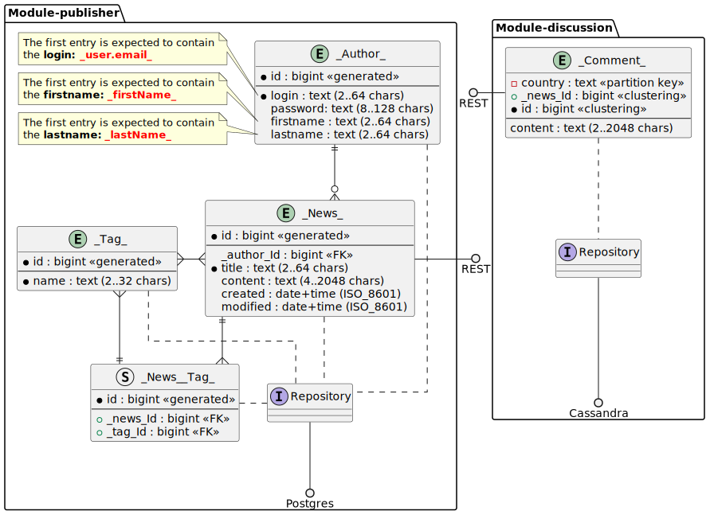
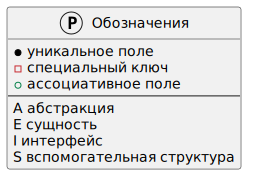

#  Task330. Application modularization with the **Cassandra base**

### Given:
- The system under development handles the entities **{{Author}}**, **{{News}}**, **{{Tag}}**, and **{{Comment}}**, 
which are logically connected by relations
    - one-to-many (**{{Author}}** and **{{News}}**, **{{News}}** and **{{Comment}}**)
    - many-to-many (**{{News}}**, **{{Tag}}**).
- You need to migrate the storage of the **{{Comment}}** entity from the **Postgres relational database 
  into a new module/microservice with a different database, namely **Cassandra**

### Task
In the previously developed application, it is necessary to highlight the discussions 
based on the **{{Comment}}** entity into a separate **discussion** module.
For the correct distribution of information in the database nodes, you need to change the structure of the **{{Comment}}** entity according to the scheme.
Instead of a module, it is possible to develop a separate microservice **discussion**. 

The basis for the task is the following scheme of the appendixя

### Technical requirements

- Use the **/api/v1.0/** prefix for REST controllers and their methods,
- Use the address and port of **localhost:24110** for the application itself (according to the scheme, this is the **publisher** module).
- Use the address and port of **localhost:24130** for the **discussion** module being implemented.
- Use the following information when connecting to Cassandra
  - Driver prefix **jdbc:cassandra:**
  - Database address **localhost**
  - Database port **9042**
  - user is not needed
  - no password needed
  - Diagram **distcomp**
- Use the required **tbl_** prefix for the table(s) in the database

### References

#### Project setup (Spring recommended)
1. If you haven`t already, convert your design to a multi-module design. 
The structure is arbitrary, but there should be at least two modules: **publisher** and **discussion**
2. Next, you need to add dependencies to **discussion** to work with Cassandra (for maven, this is a pom.xml file)
3. Create a **discussion** configuration to connect to the Cassandra database

#### Module development **discussion**
1. Create Data Model Class(s)
2. Create repositories to interact with the Cassandra database
3. Configure entity mapping to tables in the database
4. Implement the business logic of the **discussion** services, including DTO transformations

#### Creating REST controllers
1. Implement REST support for the **discussion** module
   - Create controllers to handle HTTP requests via the helper REST address **localhost:24130**
   - Configure request routing to the appropriate controller methods
2. Use this REST connection in the **publisher** module (for Spring, WebClient or RestClient is recommended)

#### Running and testing the module **discussion**
1. Use **liquibase** to initialize the Cassandra database, the schema is **distcomp**. This can be tricky (Google to the rescue).  
2. Perform module/microservice test coverage **discussion** (**jacoco** is recommended to measure the coverage level, 80% or more is desirable)
3. From the development environment or build system, verify that unit tests are running.
4. Check the module`s operability with integration tests through the auxiliary REST address **localhost:24130** of the **discussio modulen**

#### Checking the application
1. Check the correctness of the regression tests through the external REST address of the application **localhost:24110**
2. Build the project and package it into an executable file with the necessary dependencies to run (JAR for Java)
3. Run the application from the development environment (for example, a JAR file - using the java -jar <имя_файла.jar> command)

### Additional steps (optional)
1. Optimize the performance of the module/microservice **discussion** (e.g. you can choose a different field for partitioning in Cassandra)
2. Set up testing via database deployment in Testcontainers
3. Set up monitoring and logging (there are a lot of options here)
