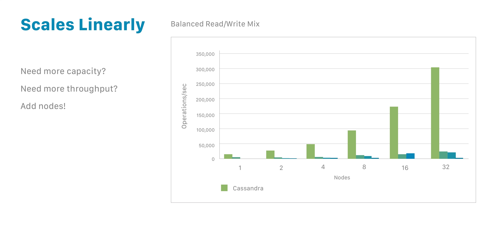

# NoSQL Cluster Cassandra

# Теория

[NoSQL](https://ru.wikipedia.org/wiki/NoSQL)

[Apache Cassandra](https://ru.wikipedia.org/wiki/Apache_Cassandra)

# **How to get started with Cassandra**

Cassandra is a distributed NoSQL database. By design, NoSQL databases are lightweight, open source, non-relational and largely distributed. Their strengths include horizontal scalability, distributed architecture and flexible approach to schema definition.

NoSQL databases provide fast, specialized organization and analysis of very large volumes of disparate types of data. This has become even more important in recent years with the advent of big data and the need to quickly scale databases in the cloud. Cassandra is one of a number of NoSQL databases that address the limitations of previous data management technologies such as SQL databases.

# **Distribution provides power and stability**

One of the important attributes of Cassandra is that its databases are distributed. This provides both technical and business benefits. Cassandra databases are easily scalable, when the application is under high load, and the distribution also prevents data loss due to hardware failure in any given data center. The distributed architecture also provides technical power; for example, the developer can tune the throughput of read requests or isolated write requests.

"Distributed" means that Cassandra can run on multiple machines, presenting a single entity to users. There is little point in running Cassandra as a single node, Although this is very useful to help you understand how it works faster, to get the most out of Cassandra, you should run it on multiple machines.

Since it is a distributed database, Cassandra can have (and usually does have) multiple nodes. A node is a single instance of Cassandra. These nodes communicate with each other via a protocol, which is a process of computer peer-to-peer communication. Cassandra also has a special architecture - any node in the database can provide the same functionality as any other node, which contributes to the reliability and fault tolerance of Cassandra. Multiple nodes can be logically organized into a cluster or "ring". You can also have multiple data centers.

# **Want more power? Add more nodes**

One of the reasons for Cassandra's popularity is that it allows developers to dynamically scale their databases, using ready-made equipment, without downtime. You can expand, when you need it, and also decrease if the application requirements suggest this path.

You may be used to Oracle or MySQL databases. If so, you know that expanding them to support more users or storage capacity requires you to increase CPU power, RAM or faster disks. Each of these costs a significant amount of money. And yet: in the end, you will still encounter some limitations.

In contrast, Cassandra makes it easy to increase the amount of data it can manage. Because Cassandra is node-based, It scales horizontally (called horizontal scaling) using cheaper hardware. To double the capacity or double the throughput, double the number of nodes.

That's all there is to it. Need more power? Add more nodes — whether it's 8 more or 8,000 — without downtime. You also have the option to scale down if you want.

This linear scalability is applied almost indefinitely, and has become one of Cassandra's key strengths.

# Introducing scalability

In Cassandra, the data itself is automatically distributed, with (positive) consequences for performance. This is achieved using partitions. Each node owns a certain set of tokens, and Cassandra distributes data based on ranges of these tokens across the cluster. The partition key is responsible for distributing the data across nodes and is important for determining the location of the data. When data is inserted into the cluster. The first step is to apply a hash function to the partition key. The output is used to determine whether which node (based on the token range) will receive the data.

When data arrives, the database coordinator takes over the job of assigning it to a given partition — let’s call it partition 59. Remember that any node in the cluster can take on the role of coordinator. As we mentioned earlier, nodes communicate with each other; during which they communicate which node is responsible for which ranges. So, in our example, the coordinator does a lookup: which node has token 59? When it finds the right one, it forwards that data to that node. The node that owns the data for that range is called a replica node. A single piece of data can be replicated to multiple nodes (replicas), providing reliability and fault tolerance. So far, our data has only been replicated to one replica. This represents a replication factor of one, or RF = 1.

The coordinator node is not a single location; the system would be fragile if it were. It is simply the node that receives the request at that particular moment. Any node can act as a coordinator.

# **Replication provides reliability and fault tolerance**

A single piece of data can be replicated across multiple nodes (replicas), providing reliability and fault tolerance. Cassandra supports the concept of a replication factor (RF), which describes how many copies of your data should exist in the database. So far, our data has only been replicated to one replica (RF = 1). If we increase this to a replication factor of two (RF = 2), the data must also be stored on a second replica, and therefore each node becomes responsible for a secondary token range in addition to its primary range. A replication factor of three ensures that there are three nodes (replicas) covering that particular token range, and the data is stored on one more.

The distributed nature of Cassandra makes it more fault-tolerant and performant. This is really important when we have multiple replicas of the same data. It helps the system self-heal if something goes wrong, like a node going down, a hard drive crashing, or AWS rebooting an instance. Replication ensures that no data is lost. If a request comes in for data, even if one of our replicas is down, the other two are still available to fulfill the request. The coordinator also keeps a “hint” for that data, and when the downed replica comes back up, it will detect what it missed and catch up with the other two replicas. No manual action is required, it’s done completely automatically.

Using multiple replicas also provides performance benefits. Since we are not limited to a single instance, we have three nodes (replicas) that can be accessed to provide data for our operations, and between which we can distribute the load for best performance.

Cassandra automatically replicates this data across data centers. Your application can write data to a Cassandra node on the West Coast of the United States, and that data will automatically be available in data centers on nodes in Asia and Europe. This has positive performance benefits, especially if you support a user base around the world. In a world dependent on cloud computing and fast data access, no user suffers from latency due to distance.

# **Setting Your Consistency**

We’ve talked a lot about distributed systems and availability. If you’re familiar with the CAP theorem, Cassandra is an AP (Available Partition-tolerant) database by default, so it’s “always on.” But you can actually configure consistency on a per-query basis. In this context, the consistency level is the minimum number of Cassandra nodes that must acknowledge a read or write operation to the coordinator before the operation is considered successful. Typically, you choose the consistency level (CL) based on the replication factor.

In the example below, our data is replicated across three nodes. We have CL=QUORUM (quorum refers to a majority, 2 replicas in this case, or RF/2 +1), so the coordinator will need to receive confirmation from two replicas for the request to be considered successful.

As with other computing tasks, it can take some skill to learn how to tune this feature for ideal performance, availability, and data integrity, but the fact that you can manage it at such a granular level means you can control your deployment down to the last detail.

Ultimately, Cassandra is deployment agnostic. It doesn’t matter where you host it — on a server, on a cloud provider, on multiple cloud providers. You can use a combination of them for a single database. This gives software developers maximum flexibility.

