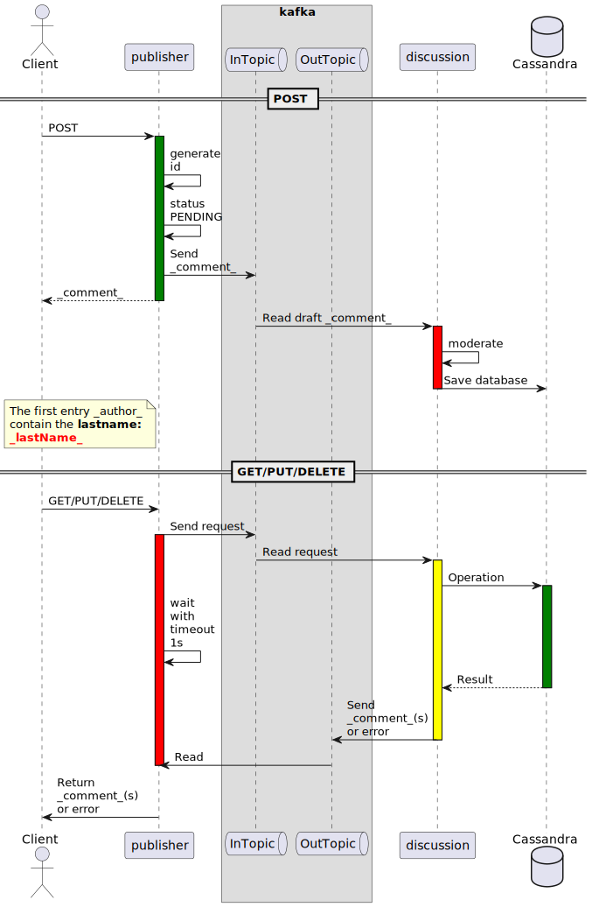

#  Task340. Message brokers (using Apache Kafka as an example)

### Given:
- The system under development handles the entities **{{Author}}**, **{{News}}**, **{{Tag}}**, and **{{Comment}}**, that are logically related (see previous tasks)
    - one-to-many (**{{Author}}** and **{{News}}**, **{{News}}** and **{{Comment}}**)
    - many-to-many (**{{News}}**, **{{Tag}}**).
- REST transfer exists and works between the **publisher** and **discussion** modules of the **{{Comment}}** entity

### Task
It is necessary to implement transport between the **publisher** and **discussion** modules in the previously developed distributed application
for the **{{Comment}}** entity via Kafka topics.

The basis for completing the task is the following interaction diagram




### Technical requirements

- Use the **/api/v1.0/** prefix for REST controllers and their methods,
- Use the address and port of **localhost:24110** for the application itself (this is the **publisher** module).
- Do not disable the REST **localhost:24130** for the **discussion** module.
- Use the required **tbl_** prefix for the table(s) in the database(s)
- Use the default connection to **Kafka** from [hub.docker.com](https://hub.docker.com/r/confluentinc/cp-kafka)
  - Startup example:
    ```
    docker network create kafkanet

    docker run -d --network=kafkanet --name=zookeeper -e \
    ZOOKEEPER_CLIENT_PORT=2181 -e ZOOKEEPER_TICK_TIME=2000 -p 2181:2181 \
    confluentinc/cp-zookeeper
    
    docker run -d --network=kafkanet --name=kafka -e \
    KAFKA_ZOOKEEPER_CONNECT=zookeeper:2181 -e \
    KAFKA_ADVERTISED_LISTENERS=PLAINTEXT://localhost:9092 -e \
    KAFKA_OFFSETS_TOPIC_REPLICATION_FACTOR=1 -p 9092:9092 \
    confluentinc/cp-kafka
    ```
### Recommendations

#### **Preparatory Steps:**
- Review the Apache Kafka documentation.
- Install and configure Apache Kafka locally using docker.
- Create a state field in the **{{Comment}}** entity with three states PENDING APPROVE DELCINE
- Create **InTopic** and **OutTopic** topics for messaging or automate the creation of topics when they are not available (Spring does this automatically)

#### Kafka integration with **publisher:**
- Create a Kafka Producer in the **publisher** module to send messages to the **InTopic** topic.
- Configure the sending of **{{Comment}}** so that in the topic of **InTopic** messages 
  those belonging to the same **{{News}}** always ended up in the same **partition** (regardless of the number of **partition**).
- Create a Kafka Consumer to read messages from OutTopic.

#### Kafka integration with **discussion:**
- Create a Kafka Consumer in the **discussion** module to read queries from the **InTopic** topic:
  - the module should update its status after automatic moderation to APPROVE or DELCINE
  - The moderation algorithm can be any, for example, based on stop words
- Create a Kafka Producer in the **discussion** module to send answers to the **OutTopic** topic.

#### Testing and debugging:
- Test the transmission of messages via Kafka.
- Check the regression of the system after Kafka integration.

#### Scaling and optimization:
- Optimize Kafka settings for better performance.
- Consider scaling Kafka for fault tolerance.
- Define the minimum number of brokers, partitions, and RFs to ensure the fault tolerance of a Kafka cluster.

### Additional steps (optional)
1. Optimize the performance of the module/microservice **publisher** (e.g. use caching)
2. Set up testing via database deployment in Testcontainers
3. Set up monitoring and logging (there are a lot of options here)
